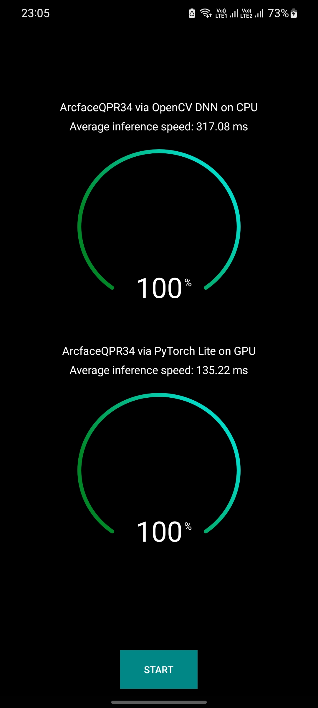

# IResNet Arcface on Android



## Requirements

- Download the pretrained models from [here](https://www.dropbox.com/home/weights/android)).

## Testing

Connect the mobile phone and run the application.

## Credits

This project is made possible by the wonderful people and projects listed in this document.

1. Fadi Boutros - [Masked-Face-Recognition-KD](https://github.com/fdbtrs/Masked-Face-Recognition-KD)
2. Jia Guo - [Insightface](https://github.com/deepinsight/insightface)
3. Jiankang Deng - [Insightface](https://github.com/deepinsight/insightface)
4. Xiang An - [Insightface](https://github.com/deepinsight/insightface)
5. Jack Yu - [Insightface](https://github.com/deepinsight/insightface)
6. Baris Gecer - [Insightface](https://github.com/deepinsight/insightface)

## Citation

```
@inproceedings{deng2019arcface,
  title={Arcface: Additive angular margin loss for deep face recognition},
  author={Deng, Jiankang and Guo, Jia and Xue, Niannan and Zafeiriou, Stefanos},
  booktitle={Proceedings of the IEEE Conference on Computer Vision and Pattern Recognition},
  pages={4690--4699},
  year={2019}
}
@inproceedings{an2020partical_fc,
  title={Partial FC: Training 10 Million Identities on a Single Machine},
  author={An, Xiang and Zhu, Xuhan and Xiao, Yang and Wu, Lan and Zhang, Ming and Gao, Yuan and Qin, Bin and
  Zhang, Debing and Fu Ying},
  booktitle={Arxiv 2010.05222},
  year={2020}
}
@INPROCEEDINGS{huber2021maskinvariant,  
   author={Huber, Marco and Boutros, Fadi and Kirchbuchner, Florian and Damer, Naser},  
   booktitle={2021 16th IEEE International Conference on Automatic Face and Gesture Recognition (FG 2021)},   
   title={Mask-invariant Face Recognition through Template-level Knowledge Distillation},   
   year={2021},  
   volume={},  
   number={},  
   pages={1-8},  
   doi={10.1109/FG52635.2021.9667081}
}
```